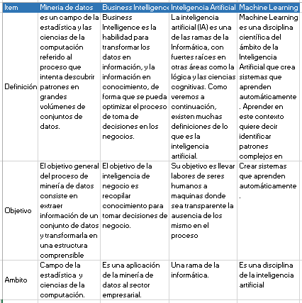

```{r setup, include=FALSE}
knitr::opts_chunk$set(echo = TRUE)
```

## 1. ¿Que es mineria de datos?

La mineria de datos es el conjunto de tecnicas y herramientas utilizadas para el procesamiento de grandes  
conjuntos de datos, donde entre sus objetivos, se encuentran la identificación de patrones, y tendencias,  
para estos conjuntos.

## 2. Cuadro comparativo



## 3. Preparacion de datos

Esta es una fase del proceso de mineria de datos que en si misma esta compuesta por 5 etapas:

### I Selección de datos:

Aquí se decide que datos seran usados para el analisis, bajo los criterios desarrollados,  
por los objetivos de este proceso de mineria.

### II. Limpieza de datos:

Llevar la calidad de los datos al nivel requerido por las tecnicas de analisís seleccionadas.  Seleccionando subconjuntos de los datos ya seleccionados, y la inserción de datos por defecto en campos vacios, entre otras tecnicas, para refinar y enriquecer los datos.

### III. Construir datos:

La construcción de nuevos atributos derivados de los ya existentes, por ejemplo,  area = longitud * altura

### IV. Integrar datos:

Se integra la información de multiples tablas o registros, para crear nuevos  
registros o valorES.

### V. Formatear datos:

Modificaciones de formato a los datos, sin alterar su significado, generalmente con objetivos  visuales y de difusión.

## 4. Dato faltante

Son aquellos datos que de los que no se dispone, debido a errores de transcripción u otros   factores, son un factor  
perturbante a la hora de realizar el analisis de datos, debido a que, disminuyen el tamaño de las muestras y consecuentemente la potencia de las pruebas.

## 5. Dato atipico

Son registros cuyo contenido es muy diferente a la del resto de los registros y tienes a ser  
causados por: 

*1* Errores de procedimiento  
*2* Acontecimientos extraordinarios  
*3* Valores Extremos  
*4* Causas no conocidas  

## 6. Correlación

Hace referencia al procedimiento estadistico que entrega el vinculo entre 2 variables.

*Correlación negativa:*

Habla de la proporcionalidad de las variables, que tienen relación, ejemplo, donde x puede   describir a un y, pues su comportamiento es lineal al de x.

*Correlación positiva:*

El comportamiento de la relación de x,y es totalmente opuesto.


## 7. Taller

```{r}

x <- c(1,3,2,5) 
x 


x = c(1,6,2) 
x 
y = c(1,4,3)


length(x)
length(y)
x+y


ls()
rm(x,y) 
ls()


rm(list=ls())


?matrix

x=matrix(data=c(1,2,3,4), nrow=2, ncol=2)
x
x=matrix(c(1,2,3,4) ,2,2)
matrix(c(1,2,3,4) ,2,2,byrow=TRUE)
sqrt(x)
x^2
x=rnorm(50)
y=x+rnorm(50,mean=50,sd=.1)
cor(x,y)
set.seed(1303)
rnorm(50)
set.seed(3)
y=rnorm(100)
mean(y)
var(y)
sqrt(var(y))
sd(y)
```

### Graficas
```{r}

x=rnorm(100)
y=rnorm(100)
plot(x,y)
plot(x,y,xlab="this is the x-axis",ylab="this is the y-axis",main="Plot of X vs Y")
pdf("Figure.pdf")
plot(x,y,col="green")
dev.off()
x=seq(1,10)
x
x=1:10
x
x=seq(-pi,pi,length=50)
y=x
f=outer(x,y,function(x,y)cos(y)/(1+x^2))
contour(x,y,f)
contour(x,y,f,nlevels=45,add=T)
fa=(f-t(f))/2
contour(x,y,fa,nlevels=15)
image(x,y,fa)
persp(x,y,fa)
persp(x,y,fa,theta=30)
persp(x,y,fa,theta=30,phi=20)
persp(x,y,fa,theta=30,phi=70)
persp(x,y,fa,theta=30,phi=40)

```

### Indexación
```{r}
A=matrix(1:16,4,4)
A
A[2,3]
A[c(1,3),c(2,4)]
A[1:3,2:4]
A[1:2,]
A[,1:2]
A[1,]
A[-c(1,3),]
A[-c(1,3),-c(1,3,4)]
dim(A)
```
### cargado

```{r}

Auto=read.table("Auto.data")
fix(Auto)
Auto=read.table("Auto.data",header=T,na.strings="?")
fix(Auto)
Auto=read.csv("Auto.csv",header=T,na.strings="?")
fix(Auto)
dim(Auto)
Auto[1:4,]
Auto=na.omit(Auto)
dim(Auto)
names(Auto)

```

### Resúmenes gráficos y numéricos adicionales

```{r}

plot(Auto$cylinders, Auto$mpg)
attach(Auto)
plot(cylinders, mpg)
cylinders=as.factor(cylinders)
plot(cylinders, mpg)
plot(cylinders, mpg, col="red")
plot(cylinders, mpg, col="red", varwidth=T)
plot(cylinders, mpg, col="red", varwidth=T,horizontal=T)
plot(cylinders, mpg, col="red", varwidth=T, xlab="cylinders", ylab="MPG")
hist(mpg)
hist(mpg,col=2)
hist(mpg,col=2,breaks=15)
pairs(Auto)
pairs(~ mpg + displacement + horsepower + weight + acceleration, Auto)
plot(horsepower,mpg)
identify(horsepower,mpg,name)
summary(Auto)
summary(mpg)
         
```


## Bibliografia

dataprix(2007). Preparación de datos. https://www.dataprix.com/preparaci%C3%B3n-de-datos.  
uv. Estadistica descriptiva. https://www.uv.es/webgid/Descriptiva/  
http://conogasi.org/articulos/analisis-de-correlacion-2/  
https://diferencias.eu/entre-correlacion-positiva-y-correlacion-negativa/  
https://www.monografias.com/trabajos84/correlacion/correlacion.shtml  


